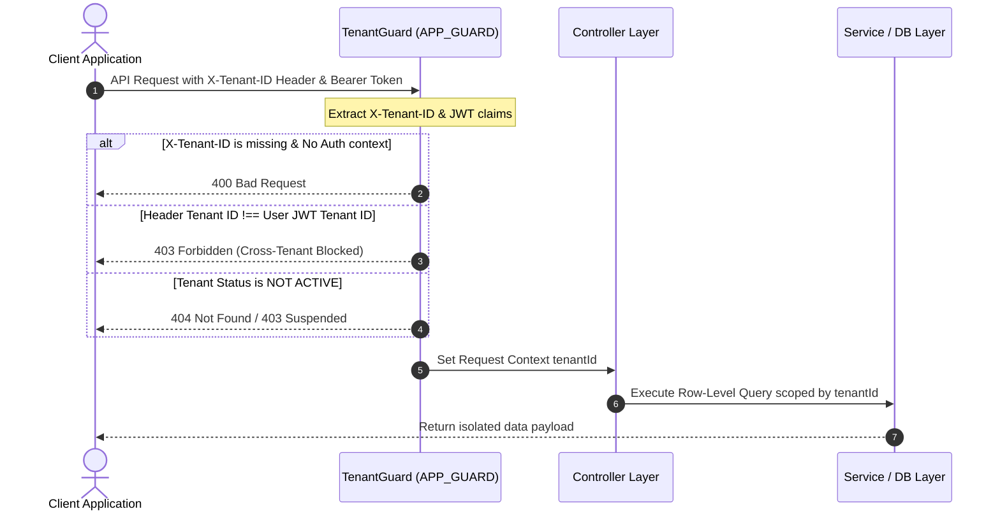
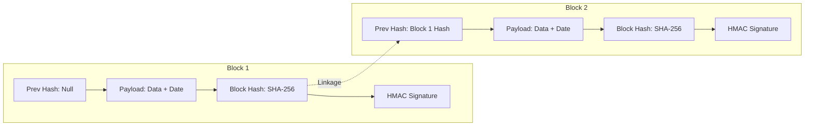

# Phase 6: Enterprise SaaS Implementation & Architecture Design

This document details the architectural blueprints, schema specifications, and production deployment configurations implemented during Phase 6 of the Hospital Management System (HMS) backend hardening.

---

## 1. Multi-Tenant Row-Level Isolation (Phase 6A)

### Design Rationale
In a modern multi-tenant healthcare enterprise system, enforcing strict row-level logical isolation is a non-negotiable requirement under regulatory mandates such as HIPAA and the EU Data Protection Act.
To achieve absolute data segregation with zero developer overhead and no changes to core business logic queries, a global interception and routing layer was implemented.

### Architecture Workflow


### Implementation Highlights
- **`TenantGuard`**: Placed globally in the NestJS dependency injection lifecycle. It extracts and compares the header `X-Tenant-ID` with the verified authentication context.
- **Bypass Rule**: Fully supports non-authenticated tenant validation (e.g. during public logins) while guaranteeing zero access to private resources.
- **Unified Header**: Enforces `X-Tenant-ID` UUID format throughout the routing system.

---

## 2. Production-Ready Kubernetes Infrastructure (Phase 6B)

A pure, declarative Kubernetes YAML ecosystem has been engineered for continuous scale and high availability, located inside the `k8s/` directory.

### Structural Topology
```
k8s/
├── configmap.yaml   # General environment definitions
├── secret.yaml      # Opaque secret mapping placeholders (safe to commit)
├── deployment.yaml  # High-availability pods specification
├── service.yaml     # Service networking (ClusterIP)
├── ingress.yaml     # SSL/TLS secured NGINX reverse proxy entry
└── hpa.yaml         # Horizontal Pod Autoscaler policies
```

### Key Production Specifications
- **Replica Scaling**: Starts with a minimum of 2 pods across different nodes for physical fault tolerance, dynamically scaling up to 10 via the **Horizontal Pod Autoscaler (HPA)** based on average CPU utilization exceeding `70%`.
- **Resource Constraints**:
  - **Memory Requests**: `256Mi` | **Limits**: `512Mi`
  - **CPU Requests**: `200m` | **Limits**: `500m`
- **Immutability & Safety**: Non-root container runtime configuration (`runAsUser: 10001`, `runAsNonRoot: true`, `allowPrivilegeEscalation: false`).
- **Liveness & Readiness**: Continuous health checks hit the custom `/health` endpoint to ensure failing pods are automatically restarted by the Kubelet.
- **Ingress TLS**: Managed using Let's Encrypt certificates mapped dynamically via cert-manager.

---

## 3. Business Intelligence & Advanced Analytics (Phase 6C)

An isolated business intelligence endpoint layer was developed to serve hospital administrators and regional operations managers under strict role boundaries.

### Metrics Computed
1. **Daily Revenue**: Aggregates ledger postings and payments dynamically grouped chronologically.
2. **Top 10 ICD-10 Diagnoses**: Extracts diagnostic frequencies filtered strictly by `deletedAt: null` to conform to clinical soft-delete governance.
3. **Bed Occupancy Rate**: Real-time bed status ratios scoped by active tenant.
4. **Queue Wait Times**: Evaluates patients joining the queue to encounter initiation to compile average waiting minutes.
5. **Claims Status Rate**: Displays current HMO approval vs rejection rates.

### RBAC Protections
All endpoints are secured via NestJS `RolesGuard` to block standard staff roles (e.g., Nurse, Doctor, Clerk) and authorize only `ADMIN` or the newly seeded `ANALYST` roles.

---

## 4. Cryptographic Audit Chain of Custody (Phase 6D)

To guard the audit system against insider threats and database tampering (e.g., deleting billing records or modifying diagnosis history), a cryptographically chained block structure has been implemented on the `AuditLog` table.

### Ledger Hash Chaining Model


### Cryptographic Security Specs
- **SHA-256 Linkage**: Each new `AuditLog` captures the `hash` of the immediately preceding record as its `previousHash`, ensuring a single-link chain. Modifying any block in the past invalidates the hash of every subsequent block.
- **HMAC Signatures**: Each hash is signed using a highly protected SHA-256 HMAC secret (`process.env.JWT_SECRET`), preventing attackers from re-generating the entire hash chain offline.
- **Immutable Triggers**: Enforced by Postgres database triggers (`audit_log_immutable`) that fully block all standard `UPDATE` or `DELETE` statements on audit log records.
- **Chronological Verification**: The `verifyChain()` API chronologically traverses all logs under a tenant, re-computes hashes, and reports the exact ID of any corrupted logs.

---

## 5. Real-Time SLA Alerting & Notification Dispatch (Phase 6E)

To maintain system response standards and emergency readiness, the system integrates a real-time Service Level Agreement (SLA) monitoring system.

### Alert Flow
```
[Background SLA Cron / Queue Job]
               │
               ▼
   [Analytics Wait Time Check]
               │
               ├───────► Is wait time <= 15 minutes? ──► [Log metrics & Do nothing]
               │
               └───────► Is wait time > 15 minutes? (BREACH!)
                               │
                               ▼
                   [Create SlaAlert Record]
                   (Status: TRIGGERED)
                               │
                               ├───────► [SMS Dispatch to Operations Pager (+15550199)]
                               │         (Priority: HIGH)
                               │
                               ▼
                   [Admin Acknowledges Alert]
                   (Status: ACKNOWLEDGED, resolution tracked)
```

### Key Alert States
1. **`TRIGGERED`**: A threshold breach is detected, an alert is saved, and a high-priority SMS is pushed into the notification dispatcher queue.
2. **`ACKNOWLEDGED`**: Operations staff has marked the breach as recognized, recording reasons for operational audit records.
3. **`RESOLVED`**: The metric falls back below SLA boundaries.
