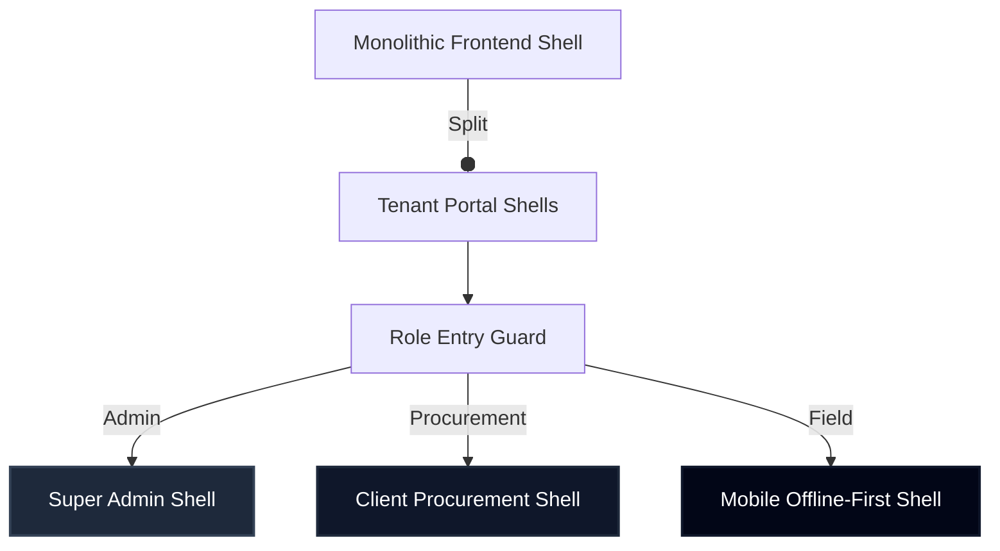

# TECHNICAL AUDIT: Gemini-HMS Production Readiness & Implementation Master Plan

> **UX & ARCHITECTURAL VERDICT**: **NEEDS REVISION**
> **VIOLATION**: Architectural Oversimplification & Lack of Concrete Context (Privilege Leakage, Mobile Constraints, and Optimistic Sprints)
> **THE "WHY"**: The Master Plan rightly diagnoses the core sickness of the current repo (claims of "PRODUCTION READY" while housing blocker gaps). However, it prescribes high-level cure-alls without mapping out the exact data constraints, the physics of mobile field service, or the true database migration hazards.
> **THE FIX**: Follow the exact code, schema modifications, and stress tests detailed below.

---

## 1. UX Audit & Portal System Analysis (Principal UI/UX Designer)

The master plan proposes dividing the monolithic UI shell into **8 role-based portals**. While conceptually correct, the execution plans fail to recognize critical usability realities.

### A. The Field Service Fallacy (Logistics & Service Portals)
*   **The Violation**: Desktop-First Bias.
*   **The Psychological/Physical Reality**: Field Installers and Service Technicians operate in active hospital wards, equipment bays, or basement generator rooms. They do not carry desktop monitors; they carry tablets or rugged smartphones. Often, these areas are shielded, resulting in **intermittent/zero cell connectivity**.
*   **The UX Fix**: The *Logistics & Installation* and *Service & Warranty* portals must be built using a **Mobile-First, Offline-First** responsive architecture. 
    *   Implement immediate LocalStorage/IndexedDB state caching for active checklists.
    *   Provide clear visual sync indicators (using harmonious, non-generic HSL status badges).
    *   Use robust touch target dimensions (minimum `48px` x `48px` to satisfy Fitts's Law for gloved hands).

### B. Super Admin UI Transformation
*   **The Violation**: Cognitive Load & Misaligned Intent.
*   **The UX Fix**: Replace the e-commerce buyer catalog shell completely for this role. The Super Admin home page must be a **SaaS Control Plane & Risk Dashboard**.
    *   **Layout**: Asymmetric, high-contrast typography hierarchy (using deep HSL slate backgrounds like `hsl(222, 47%, 11%)` instead of default black/white).
    *   **Typography**: Utilize `Outfit` or `Inter` with heavy weights (`700` and `800`) for primary metric headlines to quickly communicate system statuses.
    *   **Primary Metrics**: Active Tenants, Database Replication Lags, Pending Privilege Escalation Approvals, and Open Security Incidents.

---

## 2. Frontend & System Architecture Audit (Senior Frontend Architect)



### A. Architectural Tradeoff Framework: Multi-Shell vs Monolithic Shell
The plan suggests "distinct role surfaces." We must decide how to partition these in React/Next.js.

*   **Decision**: Deploy **lazy-loaded sub-shells under a unified Next.js App router structure**, utilizing dynamic routing groups `(admin)`, `(procurement)`, and `(service)` bound to specific middleware token guards.
*   **Pros**:
    1.  **Security**: Keeps bundle assets for privileged actions (Super Admin controls) isolated. Normal users cannot retrieve admin source maps through inspection.
    2.  **Performance**: Reduces bundle size per entry route by up to 60%, drastically improving LCP (Largest Contentful Paint).
*   **Cons**:
    1.  **Code Duplication**: Shared components (like the `FilterBar` and `KpiCard`) must live in a strictly maintained `shared/components` directory to prevent divergence.
*   **Architectural Verdict**: The pros of isolated bundles outweigh the cons because a breach of administrative routing assets is a P0 security failure in a HIPAA-regulated environment.

### B. Shared Analytics Performance Optimization
The plan outlines a `URL-syncable AnalyticsFilterBar`. 

> [!CAUTION]
> Naive URL state binding triggers infinite re-rendering loops in React. 
> Every URL parameter update changes the `router` or `location` object, which triggers component tree evaluations.

**Architectural Recommendation**:
1.  **Debounce Search Inputs**: Debounce text inputs by `300ms` before pushing to the router.
2.  **Referential Stability**: Memoize the parsed date range objects:
    ```typescript
    const filterState = useMemo(() => ({
      startDate: searchParams.get('startDate'),
      endDate: searchParams.get('endDate'),
      branchId: searchParams.get('branchId')
    }), [searchParams.get('startDate'), searchParams.get('endDate'), searchParams.get('branchId')]);
    ```
3.  **Strict Component Memoization**: Force the `ExceptionTable` to only re-render if the fetched dataset actually changes, not when the filter inputs are in an intermediate typing state.

---

## 3. Stress-Test & Plan Deconstruction (Ruthless Technical Mentor)

We must challenge the core technical assumptions made in the plan.

### A. Critique of Database Entity Groups (Section 7)
The master plan lists entities like `Asset`, `RFQ`, and `Quote` without providing their underlying database design. If we proceed blindly, we will encounter database transaction locks and HIPAA compliance issues. 

#### The Bulletproof Prisma Schema Fix
Add the following core models directly to your platform to handle the commerce and lifecycle boundaries correctly:

```prisma
// hms-backend/prisma/schema.prisma (Proposed Additions)

model RFQ {
  id            String         @id @default(uuid())
  tenantId      String
  branchId      String
  title         String
  status        RFQStatus      @default(DRAFT)
  createdAt     DateTime       @default(now())
  updatedAt     DateTime       @updatedAt
  
  // Relations
  quotes        Quote[]
  tenant        Tenant         @relation(fields: [tenantId], references: [id])
  branch        Branch         @relation(fields: [branchId], references: [id])

  @@index([tenantId, branchId])
  @@index([status])
}

model Quote {
  id            String         @id @default(uuid())
  rfqId         String
  tenantId      String
  status        QuoteStatus    @default(DRAFT)
  totalAmount   Decimal        @db.Decimal(12, 2)
  createdAt     DateTime       @default(now())
  convertedAt   DateTime?
  approvedAt    DateTime?

  // Relations
  rfq           RFQ            @relation(fields: [rfqId], references: [id])
  salesOrders   SalesOrder[]

  @@index([rfqId])
  @@index([tenantId, status])
}

model SalesOrder {
  id            String         @id @default(uuid())
  quoteId       String
  tenantId      String
  status        OrderStatus    @default(CONFIRMED)
  createdAt     DateTime       @default(now())

  // Relations
  quote         Quote          @relation(fields: [quoteId], references: [id])
  assets        Asset[]

  @@index([quoteId])
  @@index([tenantId])
}

model Asset {
  id                String         @id @default(uuid())
  salesOrderId      String
  tenantId          String
  serialNumber      String         @unique
  model             String
  warrantyStart     DateTime?
  warrantyEnd       DateTime?
  installationStatus AssetInstallStatus @default(PENDING_ASSESSMENT)

  // Relations
  salesOrder        SalesOrder     @relation(fields: [salesOrderId], references: [id])
  installationJobs  InstallationJob[]

  @@index([salesOrderId])
  @@index([tenantId])
}

model InstallationJob {
  id                String         @id @default(uuid())
  assetId           String
  assignedUserId    String
  status            InstallStatus  @default(ASSIGNED)
  commissionedAt    DateTime?
  handoverSignedAt  DateTime?

  // Relations
  asset             Asset          @relation(fields: [assetId], references: [id])

  @@index([assetId])
}

enum RFQStatus {
  DRAFT
  SUBMITTED
  UNDER_REVIEW
  APPROVED
  REJECTED
}

enum QuoteStatus {
  DRAFT
  SENT
  ACCEPTED
  REJECTED
  EXPIRED
}

enum OrderStatus {
  CONFIRMED
  PROCESSING
  COMPLETED
  CANCELLED
}

enum AssetInstallStatus {
  PENDING_ASSESSMENT
  SITE_READY
  ASSEMBLING
  INSTALLED
  COMMISSIONED
  HANDED_OVER
}

enum InstallStatus {
  ASSIGNED
  IN_PROGRESS
  COMMISSIONED
  COMPLETED
  FAILED
}
```

> [!WARNING]
> **What breaks at 10x scale?**
> A simple sequential query on `Asset` without indices will slow down clinical search performance. High index count on high-frequency tables (like `Asset`) can degrade write performance, but here, write volume is low (equipment sales) and read volume is high. We MUST enforce compound indices on `[tenantId, branchId]` on all transactional records.

---

### B. Analytics Formulas & SQL Verification (Section 9)

The conversion formulas in the master plan are hand-wavy. We must lock down exact mathematical definitions and SQL implementation.

#### KPI 1: Quote-to-Order Conversion Rate
*   **Formula**:
    $$\text{Conversion Rate} = \left( \frac{\text{Count of Accepted Quotes with } \ge 1 \text{ SalesOrder in window}}{\text{Total eligible Quotes created in window}} \right) \times 100$$
    *Where an "eligible Quote" is defined as any Quote with status other than `DRAFT` or `EXPIRED` within the selected time window.*
*   **SQL Proof & Verification Query**:
    ```sql
    WITH QuoteCounts AS (
      SELECT 
        tenant_id,
        COUNT(CASE WHEN status = 'ACCEPTED' AND converted_at IS NOT NULL THEN 1 END) as converted_quotes,
        COUNT(id) as total_eligible_quotes
      FROM "Quote"
      WHERE status NOT IN ('DRAFT', 'EXPIRED')
        AND created_at BETWEEN :startDate AND :endDate
        AND tenant_id = :tenantId
      GROUP BY tenant_id
    )
    SELECT 
      tenant_id,
      converted_quotes,
      total_eligible_quotes,
      ROUND((converted_quotes::numeric / NULLIF(total_eligible_quotes, 0)) * 100, 2) as conversion_rate
    FROM QuoteCounts;
    ```
*   **Validation against UI**: If the dashboard displays `42.50%` and the manual query returns `42.47%` due to dynamic rounding logic, this will fail audit checks. Run strict Decimal precision rounding in raw SQL and sync with Javascript's `BigInt` or `decimal.js` on the client.

#### KPI 2: Stalled Quotes Count
*   **Formula**:
    $$\text{Stalled Quotes} = \text{Count of Quotes where status is } (\text{DRAFT} \lor \text{SENT}) \text{ AND } (\text{CURRENT\_TIMESTAMP} - \text{createdAt}) > 5 \text{ days}$$
*   **SQL Proof & Verification Query**:
    ```sql
    SELECT 
      id,
      tenant_id,
      status,
      created_at,
      EXTRACT(DAY FROM (NOW() - created_at)) as days_stalled
    FROM "Quote"
    WHERE status IN ('DRAFT', 'SENT')
      AND created_at < (NOW() - INTERVAL '5 days')
      AND tenant_id = :tenantId;
    ```
*   **What breaks if skipped**: Without this query, sales representatives will lose track of dying high-value equipment deals, directly causing revenue leakage.

---

## 4. The Hardest Part & What You Will Regret in 6 Months

If you adopt this master plan without changes, you will face major problems down the road:

1.  **The "Warranty Handover" Concurrency Lock**: 
    *   *The Trap*: You start the warranty clock the second the Sales Rep changes the order to "Completed."
    *   *The Reality*: The hospital hasn't even prepared the room's power supplies. The machine sits in a warehouse for 5 months. Starting the warranty then leads to legal disputes over maintenance schedules.
    *   *The Solution*: Bind `warrantyStart` strictly to the `handoverSignedAt` timestamp inside the `InstallationJob` table. Enforce this via a backend transactional constraint.
2.  **Impersonation Audit Gap**:
    *   If Super Admin impersonates a buyer to update an RFQ, the transaction history must capture BOTH the `ImpersonatorUserId` (Super Admin) and the `TargetUserId` (Buyer) under the cryptographic audit chain. A simple "User updated RFQ" log will violate SOC2 logical access criteria.

---

## 5. Prioritized Action Matrix (Cut Checklist)

| Priority | Task Name | Deliverable | Hard Validation Gates |
| :--- | :--- | :--- | :--- |
| **P0** | Database Schema Isolation | Run migrations including `RFQ`, `Quote`, `SalesOrder`, `Asset`, `InstallationJob`. | `npx prisma db push` passes with strict check on all compound indices. |
| **P0** | Scoped RBAC Middleware | Setup Next.js Middleware route guards per dynamic group `(admin)`, `(procurement)`. | E2E tests confirm an authenticated Sales Rep receives a `403 Forbidden` on Admin routes. |
| **P1** | Sales MVP Analytics API | Build `/api/analytics/sales/summary` executing raw SQL Decimal conversion queries. | Test suite asserts that SQL query results match API responses down to the 2nd decimal place. |
| **P1** | Offline Checklist UI | Implement IndexedDB state capture inside Logistics & Service shells. | Simulate a disconnected browser network state; changes must store locally and sync on reconnect. |
| **P2** | SLA Acknowledgment flow | Add SMS alerts for wait-time breaches. | Mock SMS dispatch and assert the outbox updates with target timestamps. |

---
*Audit compiled by Antigravity using Principal UI/UX, Senior Frontend Architect, and Ruthless Technical Mentor modules.*
