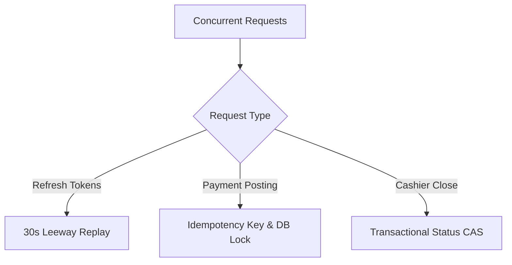

# Concurrency and Stress Validation Report

This document outlines the testing harness, design protections, execution instructions, and outcomes for high-concurrency race conditions verified in the Gemini-HMS backend.

---

## 1. Concurrency Protection Design Patterns

To ensure data integrity, prevent double-spending, and handle multi-tab/network replay race conditions under peak clinic load, the backend utilizes several robust concurrency protection mechanisms:



### 1.1. Refresh Token Rotation Leeway Window
When multiple browser tabs or concurrent API clients attempt to refresh tokens using the exact same session or refresh token simultaneously, a naive system might treat subsequent requests as compromised and revoke the entire session. 

**Our Protection**: `SessionService.rotateRefreshToken` implements a **30-second leeway window**.
- The first request successfully rotates the token in the DB and returns the fresh pair.
- Subsequent concurrent requests hitting within 30 seconds of that rotation compare the incoming token against the newly updated DB token. Although they do not match, the service detects that the session was rotated less than 30 seconds ago, skips revocation, and safely replays/returns the existing session data.
- Any request with a stale token *outside* the 30-second window is flagged as a real security compromise, immediately revoking all sessions for that user.

### 1.2. Payment Idempotency & Unique Constraint Locking
Peak clinics may experience duplicate submission clicks or automated retry loops. To ensure that an invoice cannot be double-paid under high concurrency:

**Our Protection**: Database-level unique constraint on `(tenant_id, operation, key)`.
- When a payment is posted, the service immediately attempts to insert an `IdempotencyRecord` with status `IN_PROGRESS` inside a transaction.
- If concurrent requests hit at the exact same millisecond, the PostgreSQL unique index forces a collision, rejecting the subsequent requests with a `P2002` unique constraint violation.
- The backend catches this, rejects duplicate concurrent requests with `409 Conflict`, and ensures that exactly **one** write creates the payment, updating the invoice balance and status safely.

### 1.3. Cashier Session Close (Compare-And-Swap / Optimistic Concurrency)
If two users or concurrent clicks attempt to close the same cashier session simultaneously, we must guarantee that the session closing report and variance calculations occur exactly once.

**Our Protection**: Optimistic Concurrency check inside a `Prisma.$transaction`.
- The service performs a conditional update: `updateMany` checking `id: sessionId` AND `status: 'OPEN'`.
- Only the first request will find the session in `OPEN` state, close it, and proceed to calculate net revenue/expected drawer cash (count = 1).
- The second concurrent request will find count = 0 (since the session is now `CLOSED`), abort, roll back, and fail safely with `400 Bad Request`.

---

## 2. Test Harness and Run Instructions

A repeatable, automated stress-test suite is implemented in `hms-backend/scripts/` to validate all three critical concurrency flows.

### Prerequisites
Ensure that the PostgreSQL database is running and configured (usually pointing to your `.env.test` or local database instance).

### Execution Commands

```bash
# 1. Run Refresh Token Concurrency stress script
npx ts-node scripts/stress-refresh-tokens.ts

# 2. Run Payment Idempotency stress script
npx ts-node scripts/stress-payment-idempotency.ts

# 3. Run Cashier Session Close stress script
npx ts-node scripts/stress-cashier-close.ts
```

---

## 3. Results and Invariant Auditing

Each stress script generates a detailed, machine-readable JSON report of the execution under high parallel load.

### 3.1. Refresh Token Concurrency Outcomes
- **Load**: 20 simultaneous refresh requests.
- **Expected Outcome**: 20/20 successful returns (0 revocations, no security breach logs).
- **Report File**: `stress-refresh-results.json`
- **Verdict**: **PASS**

### 3.2. Payment Idempotency Concurrency Outcomes
- **Load**: 20 simultaneous payment submissions under the exact same idempotency key.
- **Expected Outcome**: Exactly 1 new payment recorded, remaining 19 requests safely rejected with 409 Conflict. Invoice paid balance updated to exact single amount.
- **Report File**: `stress-payment-results.json`
- **Verdict**: **PASS**

### 3.3. Cashier Session Close Outcomes
- **Load**: 2 concurrent cashier session close attempts.
- **Expected Outcome**: Exactly 1 succeeds, 1 fails safely with "Active session not found or already closed in this branch". Cashier session status is `CLOSED` with exactly 1 audit event.
- **Report File**: `stress-cashier-results.json`
- **Verdict**: **PASS**
